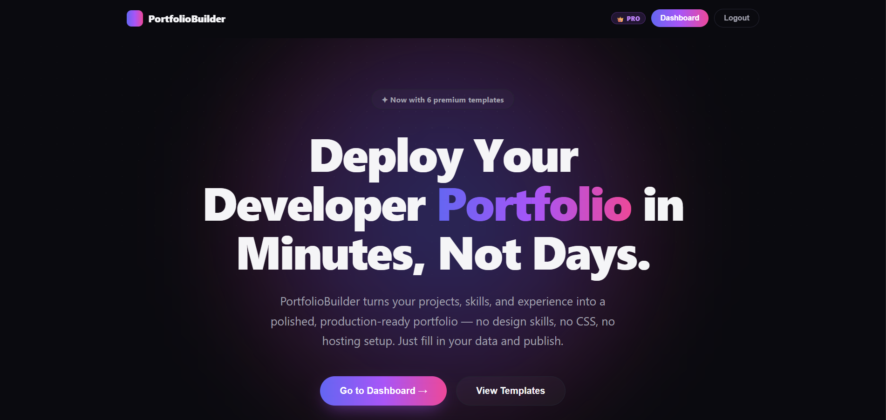
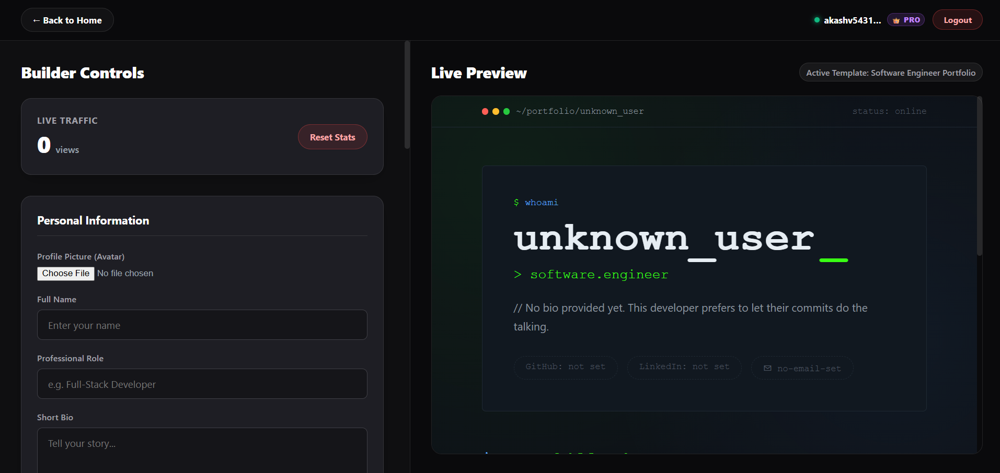

# 🚀 Student Portfolio Builder

A full-stack SaaS platform that helps students and developers create, customize, and publish professional portfolios without building a portfolio website from scratch.

[](https://react.dev/)
[](https://nodejs.org/)
[](https://www.mongodb.com/)
[](https://expressjs.com/)
[](https://razorpay.com/)
[](https://vercel.com/)
[](https://render.com/)

## 🌐 Live Application

**[Open Student Portfolio Builder](https://student-portfolio-builder-eta.vercel.app/)**

---

## 📸 Screenshots

### Landing Page



### Builder Dashboard



---

## 🎯 What the Project Does

Student Portfolio Builder is a full-stack SaaS application that allows users to:

- Create and manage their portfolio
- Edit portfolio information through a builder interface
- Preview portfolio changes in real time
- Publish a portfolio using a unique URL slug
- Upload profile and project images
- Sign in using email/password or GitHub
- Upgrade to a Pro tier through Razorpay
- Track visits to published portfolios

---

## ✨ Key Features

### 🔐 Dual Authentication
- Email/password authentication using JWT
- GitHub OAuth login
- Protected backend routes

### 🔗 Dynamic Portfolio URLs
Each user receives a unique public slug, for example:

```text
[https://student-portfolio-builder-eta.vercel.app/akash-v](https://student-portfolio-builder-eta.vercel.app/akash-v)

```

The frontend reads the slug, requests the corresponding portfolio from the REST API, and renders the selected template dynamically.

### 👀 Live Portfolio Preview

Users can edit portfolio information through the builder and see the result through a live preview without leaving the editor.

### 💳 Pro Tier & Payments

* Razorpay is integrated for premium upgrades.
* Payment verification is performed on the server using HMAC SHA256 signature verification before the user's Pro status is updated.

### 🖼️ Cloud Media Pipeline

Profile and project images are processed using:

* Multer memory buffering
* Cloudinary cloud storage

This keeps binary media outside the MongoDB database.

### 📈 Portfolio Analytics

Public portfolio visits are tracked and incremented using MongoDB atomic `$inc` operations.

---

## 🏗️ Architecture

```text
                         ┌───────────────────────┐
                         │        Browser        │
                         └───────────┬───────────┘
                                     │
                                     ▼
                         ┌───────────────────────┐
                         │ React + Vite Frontend │
                         │        Vercel         │
                         └───────────┬───────────┘
                                     │ REST / JSON
                                     ▼
                         ┌───────────────────────┐
                         │   Node + Express API  │
                         │         Render        │
                         └───────┬───────┬───────┘
                                 │       │
                    ┌────────────▼───┐ ┌─▼─────────────┐
                    │ MongoDB Atlas  │ │   Cloudinary  │
                    │    Database    │ │     Media     │
                    └────────────────┘ └───────────────┘
                                 │
                    ┌────────────▼────────────┐
                    │ GitHub OAuth + Razorpay │
                    └─────────────────────────┘

```

---

## 🛠️ Tech Stack

**Frontend:**

* React
* Vite
* React Router DOM
* Custom CSS
* Vercel

**Backend:**

* Node.js
* Express.js
* Mongoose
* MongoDB Atlas
* JWT
* GitHub OAuth
* Multer
* Cloudinary
* Razorpay
* Render

---

## 🧠 Engineering Highlights

- Designed the application as a full-stack monorepo with separate React frontend and Express backend.
- Implemented JWT authentication and GitHub OAuth with protected API routes.
- Built slug-based public portfolio routing for user-specific portfolio pages.
- Implemented server-side Razorpay HMAC SHA256 verification for payment integrity.
- Used Multer memory buffering with Cloudinary for cloud-based media handling.
- Added MongoDB-backed portfolio view analytics using atomic increment operations.
- Added backend tests for the portfolio pipeline.
- Deployed the frontend and backend separately using Vercel and Render.

## 📂 Repository Structure

```text
Student-Portfolio-Builder/
│
├── frontend/
│   ├── public/
│   ├── src/
│   ├── package.json
│   └── .env.example
│
├── backend/
│   ├── middleware/
│   ├── models/
│   ├── routes/
│   ├── tests/
│   ├── server.js
│   ├── package.json
│   └── .env.example
│
├── screenshots/
└── README.md

```

---

## 💻 Local Development

### Prerequisites

* Node.js 20+
* MongoDB Atlas or MongoDB
* GitHub OAuth application
* Cloudinary account
* Razorpay account for payment testing

### 1. Clone the repository

```bash
git clone [https://github.com/Akashv-deve/Student-Portfolio-Builder.git](https://github.com/Akashv-deve/Student-Portfolio-Builder.git)
cd Student-Portfolio-Builder

```

### 2. Start the backend

```bash
cd backend
npm install

```

Create a `.env` file in the `backend` directory:

```bash
backend/.env

```

*Use `backend/.env.example` as the reference for required variables.*

Start the backend:

```bash
npm run dev

```

### 3. Start the frontend

Open another terminal:

```bash
cd frontend
npm install

```

Create a `.env` file in the `frontend` directory:

```bash
frontend/.env

```

*Use `frontend/.env.example` as the reference for required variables.*

Start the frontend:

```bash
npm run dev

```

---

## 🔐 Environment & Security

Environment files are intentionally excluded from version control. Never commit `.env`.

Use the example files instead:

* `frontend/.env.example`
* `backend/.env.example`

Backend secrets such as database credentials, JWT secrets, OAuth client secrets, Cloudinary secrets, and Razorpay secrets must remain server-side.

---

## 🧪 Testing

Backend tests are available under `backend/tests/`.

Run the backend test suite with:

```bash
cd backend
npm test

```

---

## ☁️ Deployment

* **Frontend:** Hosted on Vercel
* **Backend:** Hosted on Render
* **Database:** Hosted on MongoDB Atlas
* **Media:** Hosted on Cloudinary
* **Payments:** Handled through Razorpay

---

## 🔮 Future Improvements

* Additional portfolio templates
* More advanced analytics
* Improved accessibility
* Automated testing coverage
* Additional customization options
* More deployment automation

---

## 👤 Author

**Akash V**

* GitHub: [Akashv-deve](https://www.google.com/search?q=https://github.com/Akashv-deve)
* LinkedIn: akashv-deve
* Live Project: [Student Portfolio Builder](https://student-portfolio-builder-eta.vercel.app/)
